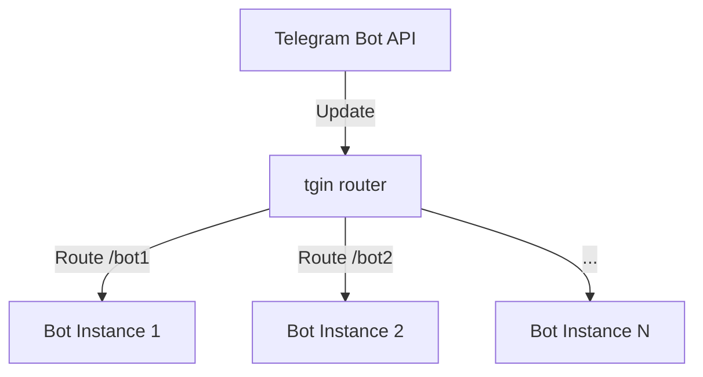

# tgin

```text
 __                          
/\ \__         __            
\ \ ,_\    __ /\_\    ___    
 \ \ \/  /'_ `\/\ \ /' _ `\  
  \ \ \_/\ \L\ \ \ \/\ \/\ \ 
   \ \__\ \____ \ \_\ \_\ \_\
    \/__/\/___L\ \/_/\/_/\/_/
           /\____/           
           \_/__/
```

<p align="center"><strong>tgin</strong> <em>— a dedicated infrastructure layer for highly loaded Telegram bots.</em><br>Think NGINX, but for the Telegram Bot API.</p>

<p align="center">
  
  <a href="https://github.com/arynyklas/tgin/releases"></a>
  <a href="DOCS.md"></a>
  <a href="PERF.md"></a>
</p>

tgin distributes incoming Telegram updates between multiple bot instances. It was built for teams scaling Telegram bots into a microservices-style deployment.

> [!IMPORTANT]
> Active development is ongoing — there is no stable release yet.

## Contents

- [Why tgin](#why-tgin)
- [Architecture](#architecture)
- [Quick start](#quick-start)
- [Documentation](#documentation)
- [Performance](#performance)
- [Roadmap](#roadmap)
- [Goal](#goal)

## Why tgin

- **Load balancing** — distributes Telegram updates across multiple bot instances.
- **Protocol flexibility** — long poll and webhook on both ingress and egress, in any combination.
- **Framework-agnostic** — works with any Telegram bot framework on the downstream side.
- **Horizontal scaling** — add bot instances without touching their code.
- **Zero-downtime deployments** — restart or replace downstream bots without dropping updates.
- **Microservices-friendly** — fan updates out to specialized services in a distributed setup.
- **Production-ready primitives** — health monitoring, retries, and failover handling baked in.

## Architecture



Updates arrive over a long-poll or webhook ingress, traverse a tree of routes and load balancers, and land on one or more downstream bots. See [DOCS.md](DOCS.md) for the full data flow and configuration reference.

## Quick start

Requires a stable Rust toolchain (edition 2021 — see `Cargo.toml`).

### 1. Clone and build

```bash
git clone https://github.com/arynyklas/tgin.git
cd tgin
cargo build --release
```

### 2. Configure `tgin.ron`

```ron
(
    dark_threads: 6,
    server_port: Some(3000),
    updates: [
        LongPollUpdate(
            token: "${TOKEN}",
        ),
    ],
    route: RoundRobinLB(
        routes: [
            LongPollRoute(path: "/test-bot/getUpdates"),
            WebhookRoute(url: "http://127.0.0.1:8080/bot2"),
        ],
    ),
)
```

`${VAR}` placeholders are substituted from the process environment before parsing; missing variables abort startup.

### 3. Run

```bash
TOKEN=123456:ABC ./target/release/tgin -f tgin.ron
```

Or run the bundled docker-compose example:

```bash
cd examples/simple
TOKEN=... docker compose up --build
```

## Documentation

- [DOCS.md](DOCS.md) — configuration reference, runtime behavior, HTTP management API, TLS setup.
- [PERF.md](PERF.md) — benchmark methodology and latest numbers.
- [examples/simple](examples/simple) — minimal docker-compose deployment with two long-poll bots and one webhook bot.
- [integrations/pytgin](integrations/pytgin) — Python `aiogram` shim that reroutes `getUpdates` through tgin.

## Performance

Headline scale-out runs — full charts (overhead and per-metric breakdowns for both transports) live in [PERF.md](PERF.md).

<table>
  <tr>
    <td colspan="2" align="center"><strong>Webhook — tgin scale-out</strong></td>
  </tr>
  <tr>
    <td></td>
    <td></td>
  </tr>
  <tr>
    <td colspan="2" align="center"><strong>Long-poll — tgin scale-out</strong></td>
  </tr>
  <tr>
    <td></td>
    <td></td>
  </tr>
</table>

## Roadmap

- [ ] Complete management API
- [ ] Expanded test and performance coverage
- [ ] Structured, production-grade logging
- [ ] Anti-DDoS guard
- [ ] Message-broker support
- [ ] First-class microservices patterns
- [ ] Analytics collection
- [ ] Per-bot caching layer
- [ ] Userbot support
- [ ] End-to-end bot tests

## Goal

Provide a complete infrastructure toolkit for building scalable, high-load Telegram bots with a microservices architecture and production-ready support.
