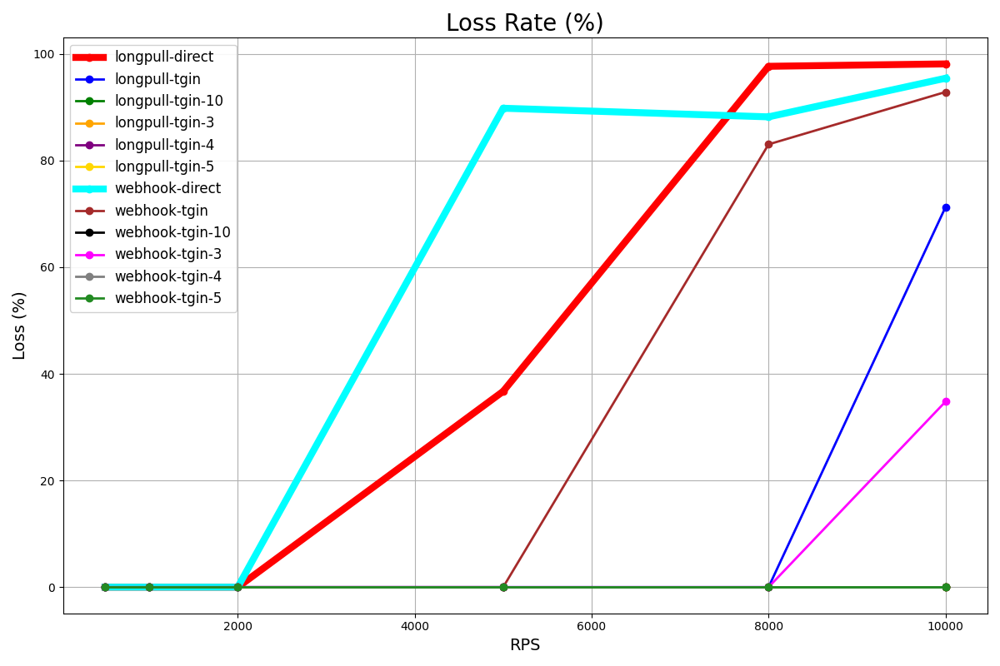
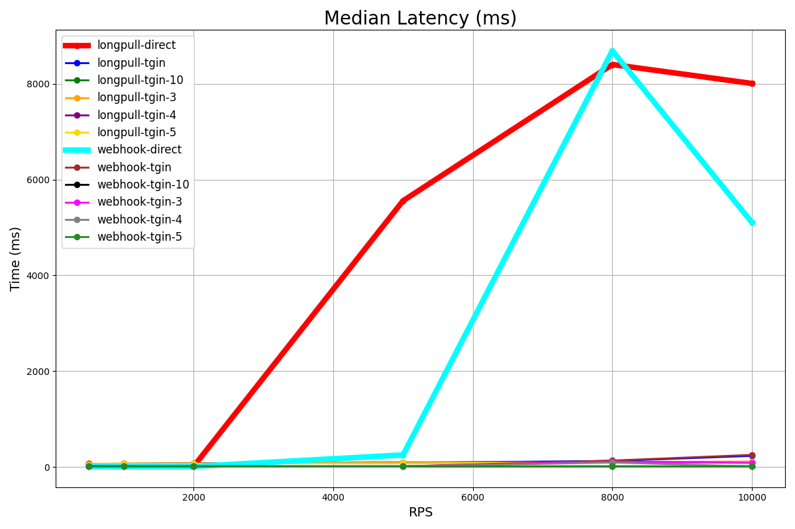
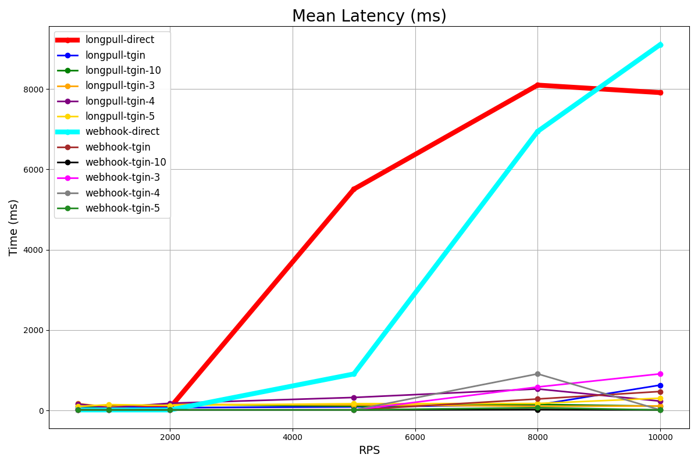
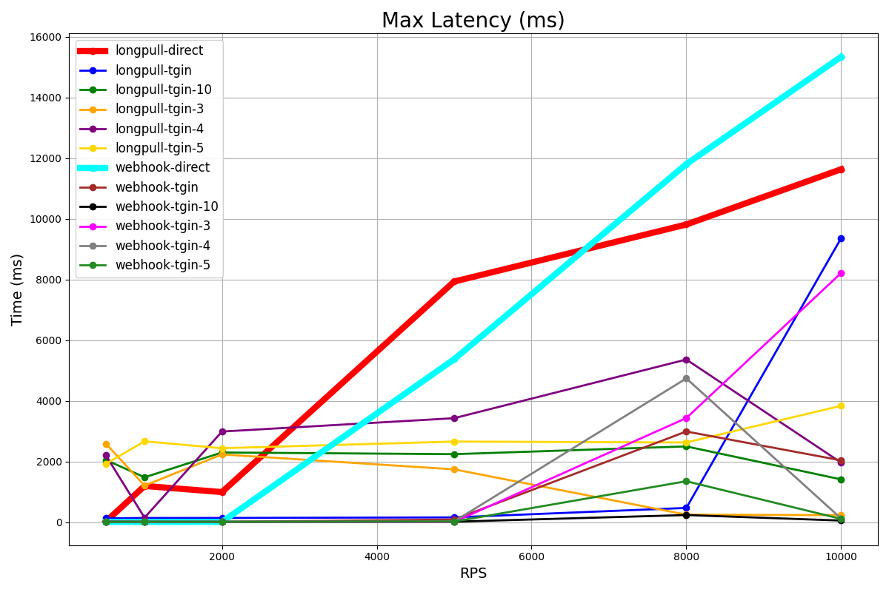

```
 __                          
/\ \__         __            
\ \ ,_\    __ /\_\    ___    
 \ \ \/  /'_ `\/\ \ /' _ `\  
  \ \ \_/\ \L\ \ \ \/\ \/\ \ 
   \ \__\ \____ \ \_\ \_\ \_\
    \/__/\/___L\ \/_/\/_/\/_/
           /\____/           
           \_/__/
```

#### dedicated routing layer for Telegram bot infrastructure that enables efficient distribution of incoming updates across multiple bot instances. Think of it as NGINX for Telegram's Bot API ecosystem

[DOCUMENTATION](DOCS.md) | [PERFORMANCE](PERF.md)

> [!IMPORTANT]
> active development is continuing: there is no stable version yet

### Why Tgin?
- Load balancing: distributes Telegram updates evenly across multiple bot instances

- Protocol flexibility: Supports both webhook and longpoll methods for receiving and sending updates

- Framework integration: works with any Telegram bot framework 

- Scalability: enables horizontal scaling by adding more bot instances without code changes

- Zero-downtime deployments: update or restart bot instances without interrupting service

- Microservices support: route updates to specialized bot services in a distributed architecture

- Production reliability: includes health monitoring, automatic retries, and failover handling

### Architecture Overview
```
Telegram Bot API
     ↓  Webhook / LongPoll 
    TGIN
     ↓  Webhook / LongPoll 
Bot Instance 1  |  Bot Instance 2  |  Bot Instance N 
```


### Quick start
```
# Clone the repository
git clone https://github.com/chesnokpeter/tgin.git
cd tgin

# Build the project
cargo build --release

# Start with config
./target/release/tgin -f tgin.ron
```

### Configuration
Simple configuration in the ron 
``` tgin.ron
// tgin.ron
(
    dark_threads: 6,
    server_port: Some(3000),

    updates: [
        LongPollUpdate(
            token: "${TOKEN}",
        )
    ],

    route: RoundRobinLB(
        routes: [
            LongPollRoute(path: "/bot1/getUpdates"),
            WebhookRoute(url: "http://127.0.0.1:8080/bot2"),
        ]
    )

)
```

### Future features
- Complete API
- More tests / Performance tests
- Perfect logging
- Anti-DDoS guard
- Message-brokers support 
- Microservices-style
- Collect analytics
- Cache for bot
- Support userbots
- Tests for Bot


### Main Goal
**Provide a complete infrastructure toolkit for building scalable, high-load Telegram bots with microservices architecture and production-ready support**

### Performance

<table>
  <tr>
    <td></td>
    <td></td>
  </tr>
  <tr>
    <td></td>
    <td></td>
  </tr>
</table>